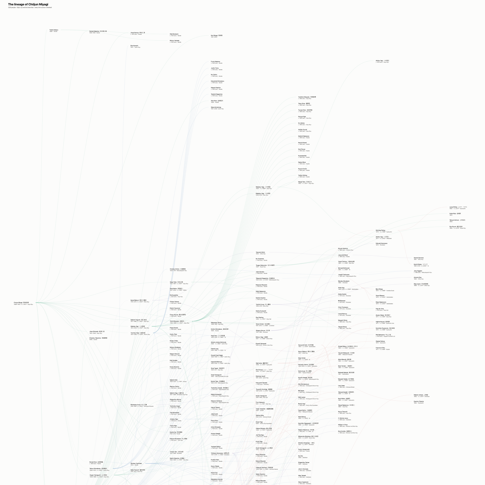

# The Lineage of Karate and Taekwondo

An interactive cladogram of who taught whom in karate, kobudō and taekwondo: **973 people, 1,264 instructor-to-student links and 187 styles**, spanning seventeen generations from the Okinawan *te* of the 1600s to practitioners born in the 1990s.

Every link carries its sources. Every disputed claim is marked as disputed.

**[▶ Open the interactive cladogram](https://amg-ai-labs.github.io/karate-lineage/)**



*The Gōjū-ryū clade: Chōjun Miyagi and the 326 people who descend from him. Exported directly from the tool as vector art.*

---

## What this is

Martial-arts lineage is usually recorded as folklore: a chart on a dojo wall, a paragraph in a style's own history, a claim of descent nobody has checked. This project treats it as a dataset. Each person is a node, each teacher-to-student relationship is an edge, and each edge is graded by the strength of the evidence behind it and linked to its source.

The result is a single connected tree rather than a set of competing family myths. 904 of the 973 people sit in one lineage; the remaining 69 are honestly marked as unlinked rather than joined by guesswork.

## The evidence

| Confidence | Links | What it means |
|---|---:|---|
| High | 738 | First-hand testimony, an interview, or a primary record |
| Medium | 401 | Documented in published histories or a style's own records |
| Low | 125 | Oral tradition, contested, or inferred from indirect evidence |

**284 links cite Mark Bishop's *Okinawan Karate: Teachers, Styles and Secret Techniques*.** Bishop interviewed the Okinawan masters directly in the 1970s and 80s, so his first-hand statements are treated as primary evidence and his relayed traditions are graded lower. The book itself is not redistributed here; it is cited by page.

The dataset began as a Wikipedia and Wikidata scrape, but little of it now rests there. It has been through a multilingual research pass (Japanese, Korean and Chinese sources), a historian's audit of every edge and every person, a full style-taxonomy build, and finally the Bishop book. Corrections that survived that process live in [`pipeline/overrides/`](pipeline/overrides/), 3,377 rows deep, each carrying a reason and its sources.

Some of what the audit threw out: Richard Kim's claimed teacher was a namesake; the Funakoshi to Plée link is false; the Motobu to Mitose link was inferred from a photograph; and a "Yoshio Nakamura" turned out to be a judoka born in 1970. Wrong-entity matches like these are the most common failure of scraped lineage data, and there were 24 of them.

## What it does

- **Click any name** to isolate that person's lineage and read their record.
- **Click any line** to see the evidence for that specific teacher-to-student claim, with live source links.
- **Browse the style tree**: family → style → sub-style → sub-sub-style, six levels deep, each with its founder and founding year. Filtering a style includes everything beneath it.
- **Export a publication-grade chart** of any person's clade or any style's clade, as vector SVG or PNG. The image above was produced this way.
- **Correct the data in the browser.** Names, dates, teachers and students can be edited, added or flagged, and the corrections export as CSVs that feed straight back into the pipeline. This is how domain experts contribute without touching code.

## How it is built

```
nodes.csv, edges.csv        the compiled source data, never modified
    │
    ├── pipeline/overrides/ every human and researched correction, with reasons and sources
    │
    ▼
pipeline/clean.py           merges, de-duplicates, resolves wrong entities, breaks cycles,
                            checks chronology, normalises styles → a guaranteed-acyclic graph
    │
    ▼
pipeline/viz/build_viz.py   time-based layout (people sit in their decade of birth)
    │
    ▼
karate-cladogram.html       one self-contained file, no dependencies, no network calls
```

Rebuild everything with:

```bash
python3 pipeline/build.py
```

Pure standard-library Python 3.9 and vanilla JavaScript. No frameworks, no build step, no `node_modules`. The build is deterministic: the same inputs produce a byte-identical output every time.

The source CSVs are never edited. Every change is a row in an override file with a `status` column (`proposed`, `confirmed`, `rejected`, `needs_decision`), so any decision can be reversed and every claim can be traced back to whoever made it and why. `pipeline/review/` is regenerated on each build and is where the pipeline reports what it changed and what it wants a human to rule on.

## Known limitations

Stated plainly, because a lineage dataset that claims certainty is lying:

- **69 people are not linked** to the main tree. Where no reliable chain exists, none is invented.
- **Three dates are contested** between Bishop and the Wikidata consensus (Sōkon Matsumura's death, Chōki Motobu's and Shigeru Nakamura's births). They are flagged for a ruling, not silently resolved. See `pipeline/review/02_needs_your_decision.csv`.
- **447 people have no recorded birth year.** Where they can be placed from their teachers and students, the chart shows an estimated cohort, marked "c. 1890 (est.)".
- **The early lineages are oral tradition.** Kūsankū, Chatan Yara and their contemporaries are recorded as they are transmitted, at low confidence, not as established fact.
- "Trained from" dates are birth + 25 estimates and are marked with an asterisk throughout.

## Contributing a correction

If you know this material and something here is wrong, the fastest route is to open the [interactive chart](https://amg-ai-labs.github.io/karate-lineage/), fix it in the panel, then use **Export → Expert corrections** to download the CSVs and attach them to an issue. Please include a source. Claims without one will be recorded at low confidence or not at all.

## Licence and citation

Code is MIT. The dataset (`nodes.csv`, `edges.csv`, `pipeline/overrides/`, `pipeline/out/`) is CC BY 4.0: use it, but cite it. Mark Bishop's book is copyright its author and publisher and is not included in this repository.

```
Guni, A. (2026). The Lineage of Karate and Taekwondo: a source-checked instructor-to-student
cladogram. https://github.com/amg-ai-labs/karate-lineage
```

Built by [Ahmad Guni](https://github.com/amg-ai-labs). With thanks to Professor Hutan Ashrafian, for whom it was made.
